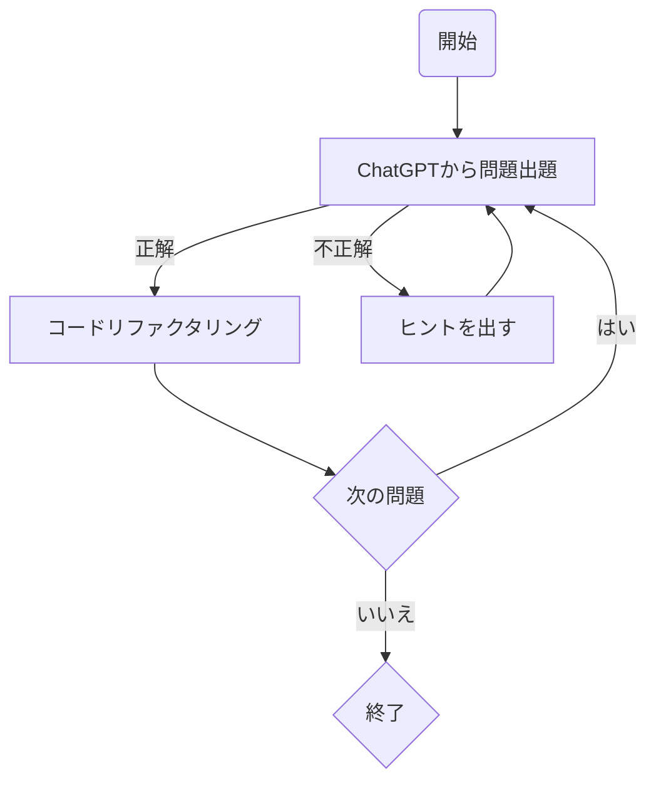

# study-java
以下のフローに沿ってJavaの学習記録を残していきます。


## 何が嬉しいのか
- 問題のレベルを5段階に分けて出題してもらうので、自分の実力がわかりやすい
- 正解したら自身のコードを最適にリファクタして提示してくれるため理解がしやすい

## 環境構築

```
docker build -t study-java .
```

```
docker run -it --rm -v "$(pwd)":/workspace -w /workspace study-java bash -c "javac HelloWorld.java && java HelloWorld"
```
