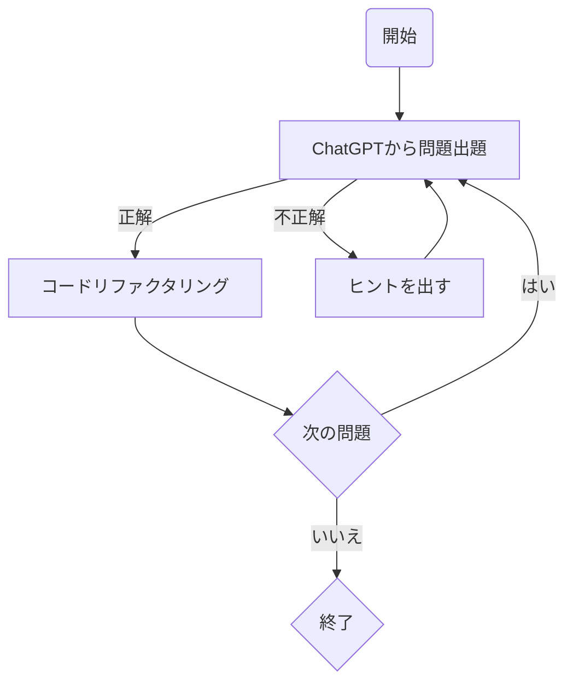

# study-java
以下のフローに沿ってJavaの学習記録を残していきます。


## 何が嬉しいのか
- 問題のレベルを段階に分けて出題してもらうので、徐々に理解できる
- 正解したらコードを最適にリファクタして提示してくれるため誤った理解を矯正してくれる
- 気になったところは何度でも質問できる

## 環境構築

```
docker build -t study-java .
```

```
docker run -it --rm -v "$(pwd)":/workspace -w /workspace study-java bash -c "javac HelloWorld.java && java HelloWorld"
```
