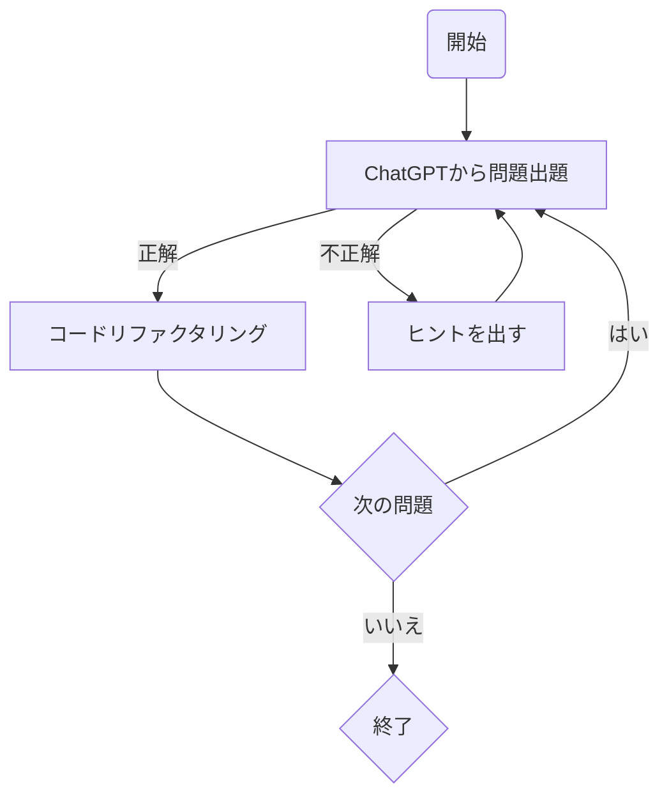

# study-java
以下のフローに沿ってJavaの学習記録を残していきます。


## 何が嬉しいのか
- 問題のレベルを段階に分けて出題してもらうので、徐々に理解できる
- 正解したらコードを最適にリファクタして提示してくれるため誤った理解を矯正してくれる
- 気になったところは何度でも質問できる

## 学習予定リスト

### 中級レベル

1. **Generics (ジェネリクス)**: 型パラメータを使用して、型安全なコードを書く。
2. **Java Collections Framework (JCF)**: `Set`, `List`, `Map`などのコレクションの深い理解。
3. **Exceptions**: カスタム例外の作成や、例外処理のベストプラクティス。
4. **File I/O**: `File`, `BufferedReader`, `FileWriter`などを使ったファイル操作。
5. **Java Database Connectivity (JDBC)**: データベースへの接続と基本的な操作。

### 上級中級レベル

1. **Stream API**: `map`, `filter`, `reduce` などの操作を利用したデータ処理。
2. **Lambda式 & Method Reference**: 無名関数とメソッド参照の使用。
3. **Concurrency (並行処理)**: `Thread`, `Runnable`, `synchronized` の基本的な使用。
4. **Annotations**: カスタムアノテーションの作成やアノテーション処理。
5. **Reflection**: 実行時にクラスやメソッドの情報を取得・操作。

### 上級レベル

1. **Advanced Concurrency**: `ExecutorService`, `Future`, `Callable`, `CompletableFuture`の使用。
2. **Java Memory Model**: メモリ管理と同期に関する深い理解。
3. **Java Modules (JPMS)**: モジュール化されたアプリケーションの作成と管理。
4. **New I/O (NIO) and NIO.2**: 高性能I/O操作と非同期ファイルI/O。
5. **Design Patterns**: Singleton, Factory, Observerなどのデザインパターンの実装と応用。
6. **JVM Internals**: ガベージコレクション, JITコンパイラ, JVMのオプションとチューニング。

## 環境構築

```
docker build -t study-java .
```

```
docker run -it --rm -v "$(pwd)":/workspace -w /workspace study-java bash -c "javac HelloWorld.java && java HelloWorld"
```
